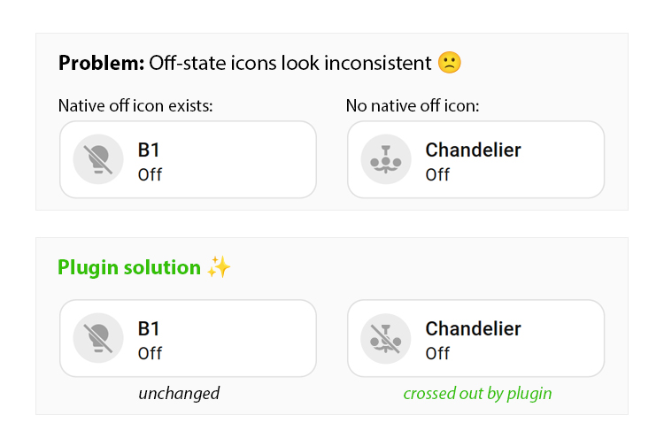

[](https://www.home-assistant.io/)
[](https://hacs.xyz/)
[](https://github.com/LanKing/ha-mdi-off-fallback/releases)
[](https://github.com/LanKing/ha-mdi-off-fallback/releases)
[](LICENSE)

> Home Assistant умеет показывать произвольные MDI-иконки, но далеко не у каждой иконки есть подходящий вариант `-off`. В итоге устройство уже выключено, а иконка визуально всё ещё выглядит активной. Этот плагин решает проблему эстетики, не заменяя стандартные карточки Home Assistant.

# 🚫 MDI Off Fallback для Home Assistant

<p align="center"></p>


Автоматически добавляет перечёркивание в стиле MDI, когда сущность Home Assistant находится в неактивном состоянии, а у выбранной иконки нет подходящего штатного перечёркнутого варианта.

Плагин работает со стандартными Tile-карточками Home Assistant и сохраняет их штатный внешний вид, поведение, цвета, размеры и взаимодействия.

Он меняет только уже отрисованную иконку — и только когда это действительно необходимо.

<a id="how-it-works"></a>
## 🤓 Как это работает

Home Assistant сам определяет, какую иконку нужно показать сущности, и отрисовывает её через свои интерфейсные компоненты.

MDI Off Fallback ждёт, пока Home Assistant отрисует иконку, а затем:

1. Находит Tile-иконки, сущности которых находятся в настроенном неактивном состоянии.
2. Не трогает иконку, если Home Assistant уже отрисовал штатный перечёркнутый вариант.
3. Берёт реальный SVG, уже отрисованный Home Assistant.
4. Через SVG-маску вырезает диагональный прозрачный канал в исходной иконке.
5. Добавляет диагональную полосу в стиле MDI в той же системе координат `24 × 24`, которую используют Material Design Icons.
6. Оставляет исходный SVG Home Assistant в DOM, чтобы штатные обновления интерфейса продолжали работать.

Плагин не заменяет `hui-tile-card`, не воссоздаёт стили Home Assistant вручную и не меняет состояния сущностей.

<a id="native-ui"></a>
## 🧩 Штатный интерфейс Home Assistant

Цель — чтобы добавленное перечёркивание выглядело так, будто Home Assistant умеет это сам.

MDI Off Fallback:

* использует ту иконку, которую уже выбрал и отрисовал Home Assistant;
* не заменяет стандартную Tile-карточку;
* сохраняет штатные нажатия, удержания, эффекты наведения, цвета состояний и размеры;
* использует штатный фон неактивной иконки, если Home Assistant уже его рисует;
* может добавить такой же бледный фон, если штатного фона нет;
* автоматически реагирует на изменения состояния сущности и содержимого карточки.

Отдельная пользовательская карточка не требуется.

<a id="default-states"></a>
## ⚙️ Неактивные состояния по умолчанию

По умолчанию включены такие правила:

| Домен | Неактивное состояние |
|---|---|
| `light` | `off` |
| `switch` | `off` |
| `fan` | `off` |
| `climate` | `off` |
| `media_player` | `off` |
| `cover` | `closed` |
| `humidifier` | `off` |
| `water_heater` | `off` |
| `siren` | `off` |

Другие домены и состояния можно добавить через необязательный глобальный файл конфигурации.

<a id="configuration"></a>
## 🔧 Конфигурация

Конфигурация необязательна.

Если файла конфигурации нет, используются встроенные правила выше.

Чтобы изменить правила сразу для всей установки Home Assistant, создайте файл:

```text
/config/www/ha-mdi-off-fallback.config.json
```

Пример:

```json
{
  "states": {
    "light": ["off"],
    "switch": ["off"],
    "fan": ["off"],
    "climate": ["off"],
    "media_player": ["off"],
    "cover": ["closed"],
    "humidifier": ["off"],
    "water_heater": ["off"],
    "siren": ["off"],
    "remote": ["off"]
  },
  "faint_background_when_missing": true,
  "faint_background_opacity": 0.2,
  "debug": false
}
```

В интерфейсе этот файл доступен по адресу:

```text
/local/ha-mdi-off-fallback.config.json
```

Поскольку конфигурация хранится на сервере Home Assistant, одни и те же правила используются во всех браузерах и на всех устройствах.

Файл конфигурации хранится отдельно от файлов плагина, которыми управляет HACS, поэтому обновление плагина его не перезаписывает.

Только домены, перечисленные в `states`, переопределяют встроенные значения. Чтобы отключить правило по умолчанию для конкретного домена, укажите пустой массив.

Например:

```json
{
  "states": {
    "fan": [],
    "media_player": ["off", "idle"]
  }
}
```

<a id="reload-config"></a>
### Перезагрузка конфигурации

После изменения JSON-файла конфигурацию можно перечитать без перезагрузки страницы:

```js
haMdiOffFallback.reloadConfig()
```

Посмотреть активную конфигурацию:

```js
haMdiOffFallback.getConfig()
```

<a id="background"></a>
### Фон неактивной иконки

Если Home Assistant уже рисует свой штатный фон неактивной иконки, плагин его не трогает.

Если такого фона нет, плагин может добавить бледный круг, совпадающий с оформлением стандартной неактивной Tile-иконки Home Assistant.

Отключить:

```json
{
  "faint_background_when_missing": false
}
```

Изменить прозрачность:

```json
{
  "faint_background_opacity": 0.2
}
```

<a id="installation"></a>
## 📦 Установка

### HACS

Пока плагин не добавлен в стандартный каталог HACS:

1. Откройте HACS.
2. Откройте **Custom repositories**.
3. Добавьте:

```text
https://github.com/LanKing/ha-mdi-off-fallback
```

4. Выберите тип репозитория **Dashboard**.
5. Установите **HA MDI Off Fallback**.
6. Перезагрузите интерфейс Home Assistant.

Дополнительная настройка карточек не требуется.

<a id="manual-installation"></a>
### Ручная установка

Скопируйте:

```text
dist/ha-mdi-off-fallback.js
```

в:

```text
/config/www/ha-mdi-off-fallback.js
```

Затем добавьте ресурс панели управления:

```text
/local/ha-mdi-off-fallback.js
```

Тип ресурса:

```text
JavaScript Module
```

После этого перезагрузите интерфейс Home Assistant.

<a id="debugging"></a>
## 🐛 Отладка

Включить отладочный вывод:

```js
haMdiOffFallback.configure({
  debug: true
})
```

Принудительно заново просканировать текущую панель:

```js
haMdiOffFallback.rescan()
```

Посмотреть версию плагина:

```js
haMdiOffFallback.version
```

<a id="notes"></a>
## 📓 Примечания

* Сейчас плагин ориентирован на стандартные Tile-иконки Home Assistant.
* Неактивными считаются только настроенные комбинации домена и состояния.
* Уже существующие штатные перечёркнутые иконки не изменяются.
* Перечёркнутый вариант строится из SVG, который уже отрисовал Home Assistant; собственной базы MDI-иконок у плагина нет.
* Механизм рассчитан на стандартные Material Design Icons с `viewBox="0 0 24 24"`.
* Внутренние интерфейсные компоненты Home Assistant не являются стабильным публичным API. Будущие обновления интерфейса могут потребовать обновления плагина.
* Плагин меняет только отображение. Он никогда не меняет состояния сущностей, не вызывает сервисы, не вмешивается в автоматизации и не управляет устройствами.

<a id="why"></a>
## 💡 Почему не использовать просто `mdi:*-off`?

Потому что далеко не у каждой Material Design Icon существует соответствующий перечёркнутый вариант.

Иконка может отлично выглядеть, пока устройство активно, но для выключенного состояния аналога вроде:

```text
mdi:some-icon-off
```

может просто не существовать.

MDI Off Fallback сохраняет исходную иконку и автоматически создаёт недостающее визуальное состояние.

<a id="implementation"></a>
## 🛠 Реализация

Плагин специально не подменяет Lit-компоненты Home Assistant.

Вместо этого он наблюдает уже отрисованный DOM интерфейса и проходит по штатной цепочке компонентов Home Assistant:

```text
ha-tile-icon
└── ha-state-icon
    └── ha-icon
        └── ha-svg-icon
            └── svg
```

Открытые Shadow Root рекурсивно обнаруживаются и отслеживаются на появление новых карточек и изменения состояния.

Исходный SVG остаётся под управлением Home Assistant. Плагин добавляет только визуальное перечёркивание и удаляет его, когда оно больше не нужно.

## 📄 Лицензия

MIT — вклад в проект приветствуется.
